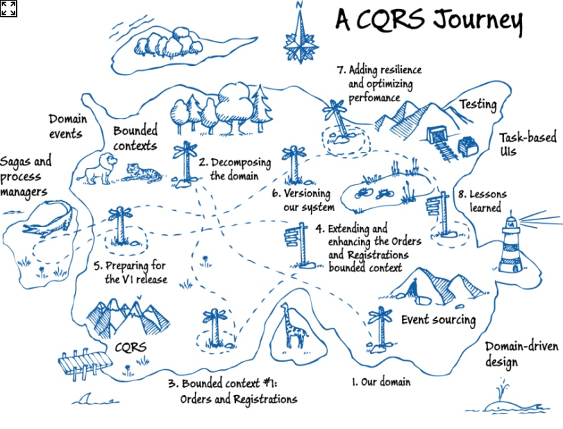
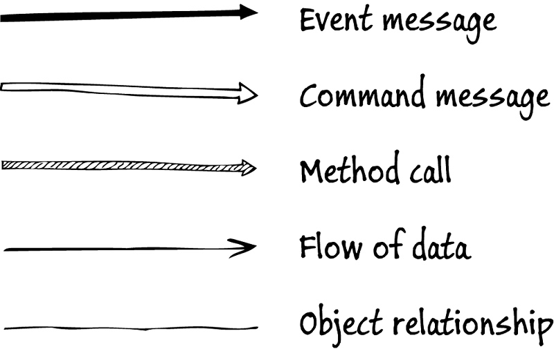

# CQRS
## Microsoft A CQRS Journey

1. 确定我们的领域
2. 分解领域
3. 界限上下文: 订单和注册
4. 扩展和增强订单和注册的有界上下文
5. 准备发布第一个版本
6. Versioning out system(版本迭代)
7. 提高扩展性和优化性能
8. 经验教训

### 相关术语
1. Domain-driven design(领域驱动设计)
2. CQRS
3. Event sourcing
4. Task-based UIs
5. Testing
6. Bounded contexts (界限上下文)
7. Domain events
8. Sagas and process managers

