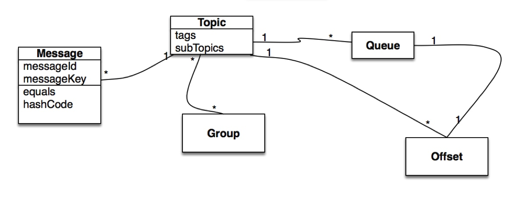

# RocketMQ
https://www.e-learn.cn/content/qita/777920

## 核心模型

## 概念介绍
### Producer
A producer sends messages generated by the business application systems to brokers. RocketMQ provides multiple paradigms of sending: synchronous, asynchronous and one-way.
> Producer将业务应用系统生成的消息发送给Brokers. RocketMQ提供多种发送方式: 同步,异步和单向.

### Producer Group
Producers of the same role are grouped together. A different producer instance of the same producer group may be contacted by a broker to commit or roll back a transaction in case the original producer crashed after the transaction.
> 具有相同角色的生产者组合在一起。如果原始生产者在事务之后崩溃，则代理可以联系同一生产者组的不同生产者实例以提交或回滚事务。

<b>Warning:</b> Considering the provided producer is sufficiently powerful at sending messages, only one instance is allowed per producer group to avoid unnecessary initialization of producer instances.

### Consumer
A Consumer pulls messages from brokers and feeds them into application. In perspective of user application, two types of consumers are provided:
> Consumer从borkers中拉取消息，并将消息给到应用程序。在用户应用看来, 可以提供两种Consumer.

#### PullConsumer
Pull consumer actively pulls messages from brokers. Once batches of messages are pulled, user application initiates consuming process.

#### PushConsumer
Push consumer, on the other hand, encapsulates message pulling, consuming progress and maintaining other work inside, leaving a callback interface to end user to implement which will be executed on message arrival.

#### Consumer Group
Similar to previously mentioned producer group, consumers of the exactly same role are grouped together and named Consumer Group.

Consumer Group is a great concept with which achieving goals of load-balance and fault-tolerance, in terms of message consuming, is super easy.

<b>Warning:</b> consumer instances of a consumer group must have exactly the same topic subscription(s).

### Topic
Topic is a category in which producers deliver messages and consumers pull messages. Topics have very loose relationship with producers and consumers. Specifically, a topic may have zero, one or multiple producers that sends messages to it; conversely, a producer can send messages of different topics. In consumer’s perspective, a topic may be subscribed by zero, one or multiple consumer groups. And a consumer group, similarly, may subscribe to one or more topics as long as instances of this group keep their subscription consistent.

### Message
Message is the information to be delivered. A message must have a topic, which can be interpreted as address of your letter to mail to. A message may also have an optional tag and extra key-value pairs. For example, you may set a business key to your message and look up the message on a broker server to diagnose issues during development.

#### Message Queue
Topic is partitioned into one or more sub-topics, “message queues”.

#### Tag
Tag, in other words sub-topic, provides extra flexibility to users. With tag, messages with different purposes from the same business module may have the same topic and different tag. Tags would be helpful to keep your code clean and coherent, and tags also can facilitate the query system RocketMQ provides.

### Broker
Broker is a major component of the RocketMQ system. It receives messages sent from producers, store them and prepare to handle pull requests from consumers. It also stores message related meta data, including consumer groups, consuming progress offsets and topic / queue info.

### Name Server
Name server serves as the routing information provider. Producer/Consumer clients look up topics to find the corresponding broker list.

### Message Model
- Clustering(集群)
- Broadcasting(广播)

### Message Order
When DefaultMQPushConsumer is employed, you may decide to consume messages orderly or concurrently.
- Orderly

Consuming messages orderly means messages are consumed the same order they are sent by producers for each message queue. If you are dealing with scenario that global order is mandatory, make sure the topic you use has only one message queue.

**Warn:** If consuming orderly is specified, the maximum concurrency of message consuming is the number of message queues subscribed by the consumer group.

- Concurrently

When consuming messages concurrently, maximum concurrency of message consuming is only limited by thread pool specified for each consumer client.

**Warn:** Message order is no longer guaranteed in this mode.