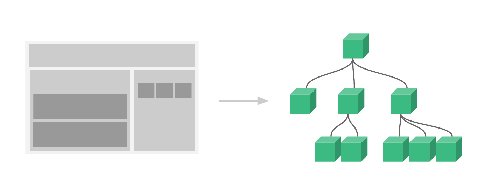

# Vue 

## QuickStart

```
<!DOCTYPE html>
<html>
<head>
	<title>Hello Vue</title>
	<script src="https://cdn.jsdelivr.net/npm/vue/dist/vue.js"></script>
</head>
<body>
	<div id="app">
		{{ message }}
	</div>

	<script type="text/javascript">
		var app = new Vue({
			el: '#app',
			data: {
				message: "Hello Vue!"
			}
		});
	</script>
</body>
</html>
```

el: 指定绑定的元素
data: 数据

## 指令
指令带有`v-`, 以表示它们是Vue提供的特殊特性，它们会在渲染DOM上应用特殊的响应式行为。

### v-bind
```
<!DOCTYPE html>
<html>
<head>
	<title>Hello Vue</title>
	<script src="https://cdn.jsdelivr.net/npm/vue/dist/vue.js"></script>
</head>
<body>
	<div id="app-2">
		<span v-bind:title="message">
			鼠标悬停几秒钟查看此处动态绑定的提示信息!
		</span>
	</div>

	<script type="text/javascript">
		var app2 = new Vue({
			el: '#app-2',
			data: {
				message: '页面加载于 ' + new Date().toLocaleString()
			}
		});
	</script>
</body>
</html>
```
将span元素节点的`title`特性和Vue实例的`message`属性保持一致

### v-if
```
<!DOCTYPE html>
<html>
<head>
	<title>Hello Vue</title>
	<script src="https://cdn.jsdelivr.net/npm/vue/dist/vue.js"></script>
</head>
<body>
	<div id="app-3">
		<p v-if="seen">现在你看到我了</p>
	</div>

	<script type="text/javascript">
		var app3 = new Vue({
			el: '#app-3',
			data: {
				seen: true
			}
		});
	</script>
</body>
</html>
```
通过v-if指令可以绑定到DOM结构，控制DOM结构的显示效果。

注:打开浏览器的 JavaScript 控制台，输入`app3.seen = false`, 你会发现之前显示的消息消失了。

### v-else
v-else 元素必须紧跟在带 v-if 或者 v-else-if 的元素的后面，否则它将不会被识别。

### v-else-if
类似于 v-else，v-else-if 也必须紧跟在带 v-if 或者 v-else-if 的元素之后。

### v-show
根据条件展示元素

### v-for
```
<!DOCTYPE html>
<html>
<head>
	<title>Hello Vue</title>
	<script src="https://cdn.jsdelivr.net/npm/vue/dist/vue.js"></script>
</head>
<body>
	<div id="app-4">
		<ol>
			<li v-for="todo in todos">
				{{ todo.text }}
			</li>
		</ol>
	</div>

	<script type="text/javascript">
		var app4 = new Vue({
			el: '#app-4',
			data: {
				todos: [{
					text: '学习JavaScript'
				}, {
					text: '学习Vue'
				}, {
					text: '整个牛项目'
				}]
			}
		});
	</script>
</body>
</html>
```
在控制台里，输入 app4.todos.push({ text: '新项目' })，你会发现列表最后添加了一个新项目。

### v-on
为了让用户和你的应用进行交互，我们可以用`v-on`指令添加一个事件监听器，通过它调用在Vue实例中定义的方法

```
<!DOCTYPE html>
<html>
<head>
	<title>Hello Vue</title>
	<script src="https://cdn.jsdelivr.net/npm/vue/dist/vue.js"></script>
</head>
<body>
	<div id="app">
		<p>{{ message }}</p>
		<button v-on:click="reverseMessage">逆转消息</button>
	</div>

	<script type="text/javascript">
		var app = new Vue({
			el: '#app',
			data: {
				message: "Hello Vue!"
			},
			methods: {
				reverseMessage: function() {
					this.message = this.message.split('').reverse().join('');
				}
			}
		});
	</script>
</body>
</html>
```
注: 在`reverseMessage`方法中，我们更新了应用的状态，但是没有触碰DOM, 所有的DOM操作都由Vue来处理, 你编写的代码只需要关注逻辑层面即可。

### v-model
通过`v-model`指令, 它能轻松实现表单输入于应用状态之间的双向绑定。
```
<!DOCTYPE html>
<html>
<head>

	<title>Hello Vue</title>
	<script src="https://cdn.jsdelivr.net/npm/vue/dist/vue.js"></script>
</head>
<body>
	<div id="app">
		<p>{{ message }}</p>
		<input type="text" name="msg" v-model="message">
	</div>

	<script type="text/javascript">
		var app = new Vue({
			el: '#app',
			data: {
				message: "Hello Vue!"
			}
		});
	</script>
</body>
</html>
```

### v-once
通过使用`v-once`指令, 我们可以执行一次性插值，当数据改变时，插值处的内容不会更新。

### v-html
双大括号会将数据解释为普通文本，而非 HTML 代码。为了输出真正的 HTML，你需要使用`v-html`指令

## 组件化应用构建
组件系统是Vue的另一个重要概念，因为它是一种抽象，允许我们使用小型、独立和通常可复用的组件构建大型应用。仔细想想，几乎任意类型的应用界面都可以抽象为一个组件树。

在Vue里，一个组件本质上是一个拥有预定义选项的一个Vue实例。在Vue中注册组件很简单:
```vue
// 定义名为 todo-item 的新组件
Vue.component('todo-item', {
    template: '<li>这是一个待办项</li>'
})
```
现在你可以用它构建另一个组件模板:
```vue
<ol>
    <!-- 创建一个 todo-item 组件的实例 -->
    <todo-item></todo-item>
</ol>
```
但是这样会为每一个待办项渲染同样的文本，这看起来并不炫酷。我们应该能从父作用域将数据传到子组件才对。让我们来修改一下组件的定义，使之能够接受一个`prop`:
```vue
Vue.component('todo-item', {
    // todo-item 组件现在接受一个 ‘prop’，类似于一个自定义特性。
    // 这个 prop 名为 todo。
    prop: ['todo'],
    template: '<li>{{ todo.text }}</li>'
})
```
现在，我们可以使用`v-bind`指令将待办项传到循环输出的每个组件中:
```html
<div id="app-7">
    <ol>
        <!--
            现在我们为每个todo-item提供todo对象
            todo 对象是变量，即其内容可以是动态的。
            我们也需要为每个组件提供一个“key”，稍后再作详细解释
        -->
        <todo-item
            v-for="item in groceryList"
            v-bind:todo="item"
            v-bind:key="item.id"
        ></todo-item>
    </ol>
</div>
```

```JavaScript
Vue.component('todo-item', {
    props: ['todo'],
    template: '<li>{{ todo.text }}</li>'
})

var app7 = new Vue({
    el: '#app-7',
    data: {
        groceryList: [{
            id: 0, text: '蔬菜'
        }, {
            id: 1, text: '奶酪'
        }, {
            id: 2, text: '随便其他什么人吃的东西'
        }]
    }
})
```
示例
```html
<!DOCTYPE html>
<html>
<head>
	<title>Hello Vue</title>
	<script src="https://cdn.jsdelivr.net/npm/vue/dist/vue.js"></script>
</head>
<body>
	<div id="app-7">
		<ol>
        <!--
            现在我们为每个todo-item提供todo对象
            todo 对象是变量，即其内容可以是动态的。
            我们也需要为每个组件提供一个“key”，稍后再作详细解释
        -->
        <todo-item
        v-for="item in groceryList"
        v-bind:todo="item"
        v-bind:key="item.id"
        ></todo-item>
    </ol>
</div>

<script type="text/javascript">
	Vue.component('todo-item', {
		props: ['todo'],
		template: '<li>{{ todo.text }}</li>'
	})

	var app7 = new Vue({
		el: '#app-7',
		data: {
			groceryList: [{
				id: 0, text: '蔬菜'
			}, {
				id: 1, text: '奶酪'
			}, {
				id: 2, text: '随便其他什么人吃的东西'
			}]
		}
	})
</script>
</body>
</html>
```
尽管这只是一个刻意设计的例子，但是我们已经设法将应用分割成了两个更小的单元。子单元通过prop接口于父但也进行了良好的解耦。我们现在可以进一步改行<todo-item>组件，提供更为复杂的模版和逻辑，而不会影响到父单元。

在一个大型应用中，有必要将整个应用程序划分为组件，以使开发更易于管理。下面是一个假想的例子，以展示使用了组件的应用模板是什么样的:
```html
<div id="app">
    <app-nav></app-nav>
    <app-view>
      <app-sidebar></app-sidebar>
      <app-content></app-content>  
    </app-view>
</div>
```

### 与自定义元素的关系
你可能已经注意到 Vue 组件非常类似于自定义元素——它是 Web 组件规范的一部分，这是因为 Vue 的组件语法部分参考了该规范。例如 Vue 组件实现了 Slot API 与 is 特性。但是，还是有几个关键差别：
1. Web Components 规范已经完成并通过，但未被所有浏览器原生实现。目前 Safari 10.1+、Chrome 54+ 和 Firefox 63+ 原生支持 Web Components。相比之下，Vue 组件不需要任何 polyfill，并且在所有支持的浏览器 (IE9 及更高版本) 之下表现一致。必要时，Vue 组件也可以包装于原生自定义元素之内。
2. Vue 组件提供了纯自定义元素所不具备的一些重要功能，最突出的是跨组件数据流、自定义事件通信以及构建工具集成。

虽然 Vue 内部没有使用自定义元素，不过在应用使用自定义元素、或以自定义元素形式发布时，依然有很好的互操作性。Vue CLI 也支持将 Vue 组件构建成为原生的自定义元素。

